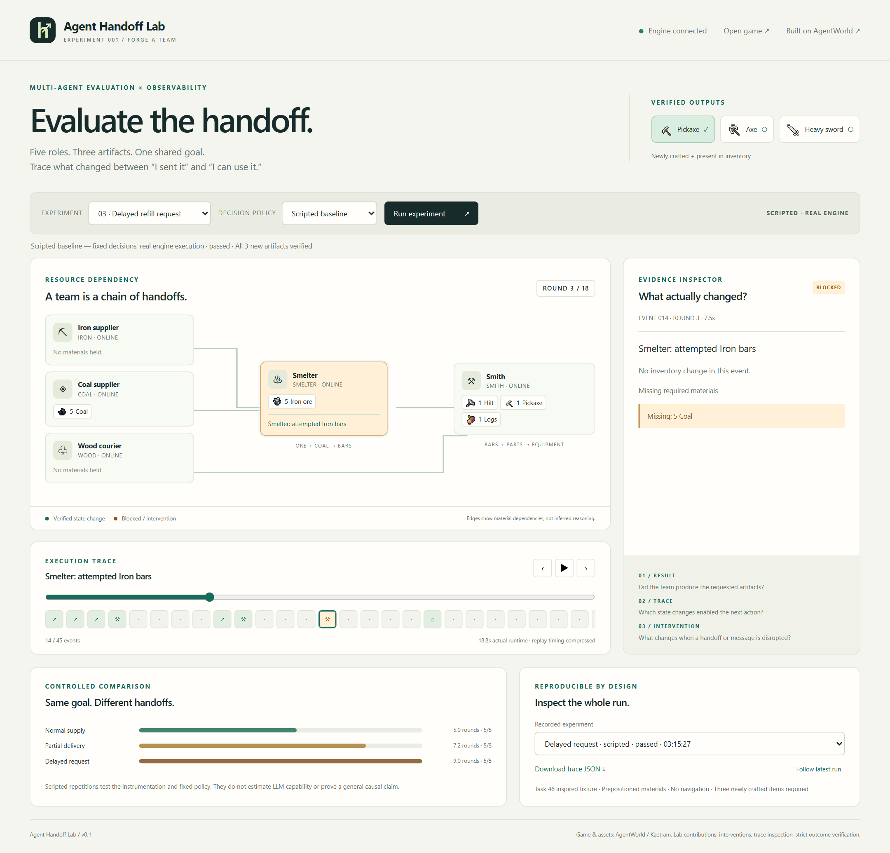

# Agent Handoff Lab

**Evaluate the handoff, not just the final outcome.**

A small, inspectable team-evaluation workbench built on the real [AgentWorld](https://github.com/openagents-org/agentworld) game engine. Five roles exchange resources and produce a pickaxe, an axe, and a heavy sword. A separate verifier checks inventory changes, and a dashboard lets you replay every action.



**v0.1 contains a scripted baseline running on the actual engine. No LLM experiments have been run.** An OpenAI-compatible tool-calling adapter is included, but requires your own model and local credentials. This is a Task 46 inspired fixture, not a reproduction of the full AgentWorld benchmark or its CCE metric.

## What is here

- A working five-role production chain using the engine's crafting API.
- Three conditions: normal delivery, partial coal delivery, and partial delivery with delayed coordination messages.
- Actual before/after inventory snapshots, replay controls, error inspection, downloadable JSON, and comparison of repeated runs.
- A verifier that requires newly crafted outputs **and** corresponding material consumption; initial inventory and agent self-reports cannot pass it.
- A 50-second HyperFrames composition using real game footage, real dashboard screenshots, and measured results.
- [Experimental method and limits](docs/METHODS.md), [LinkedIn draft](docs/LINKEDIN.md), and [中文上手说明](docs/QUICKSTART.zh-CN.md).

## Run locally

Requirements: Node.js 22, Git, Python 3.10+, and a Chromium-based browser. The lab runner uses the Python standard library only. Setup downloads the pinned upstream engine and its dependencies; allow several minutes and a few GB of disk space. The engine's bundled Yarn is used automatically.

```sh
git clone https://github.com/GuilinDev/agent-handoff-lab.git
cd agent-handoff-lab
npm run setup
npm run dev
```

Open **http://127.0.0.1:7331**. Wait for “Engine connected”, then choose a condition and click **Run experiment**. The separate game client is at **http://127.0.0.1:7032**. On first startup world-cache generation may take about a minute; startup logs are in `.runtime/logs/`.

In another terminal:

```sh
npm run demo
npm run experiment
npm test
```

The experiment command runs five repetitions of all three conditions. Run one experiment at a time: the runner holds an OS-backed lock because fixture users are shared. Ctrl+C in the development terminal stops the launched process trees. If port 7030, 7031, 7032, or 7331 is already occupied, stop the previous lab instance first.

### Watch the actual game

Log in at port 7032 as `lab_viewer`, password `local-lab-only`. While that browser is connected, run:

```sh
curl -X POST http://127.0.0.1:7031/lab/observer
python -m lab.run --mode scripted --condition delayed-request --pace 0.45
```

In Windows PowerShell use `curl.exe`, or `Invoke-RestMethod -Method Post -Uri http://127.0.0.1:7031/lab/observer`. The observer endpoint is enabled only by the local development launcher. Five fixture characters appear nearby during a run, then log out. The observer is not part of the evaluated team.

### Optional LLM mode

Edit the ignored local `.env` created by setup:

```dotenv
LLM_PROVIDER=openai-compatible
LLM_BASE_URL=https://api.openai.com/v1
LLM_MODEL=your-tool-calling-model
LLM_API_KEY=your-local-key
```

Then restart the dashboard and select LLM mode, or run:

```sh
python -m lab.run --mode llm --condition partial-delivery --max-rounds 12
```

This makes paid calls to the configured provider: at most five decisions per round. Each role sees its own inventory, delivered messages, and prior results. It does not receive other roles' private inventories. Model credentials are never included in the run artifacts. The adapter currently supports `/chat/completions` tool calling; native Anthropic APIs are not implemented. Live provider integration remains unverified in v0.1 because no API key was available.

## Recorded baseline

Actual runs from 2026-09-29 UTC; see [`artifacts/suite.json`](artifacts/suite.json) and its referenced trajectories.

| Condition | Completed | Mean rounds | Range | Mean actions |
|---|---:|---:|---:|---:|
| Normal delivery | 5/5 | 5.0 | 5–5 | 25 |
| Partial first coal delivery | 5/5 | 7.2 | 7–8 | 36 |
| Partial delivery + delayed request | 5/5 | 9.0 | 9–9 | 45 |

One partial-delivery run hit an additional engine crafting cooldown. All failures remain in the trajectories. These fixed-policy repetitions validate the instrumentation and illustrate a blind spot in outcome-only reporting; they do not estimate LLM competence or establish general causal effects.

## Video

Source: [`videos/handoff-eval/`](videos/handoff-eval/). Local footage and screenshots are included so the composition is self-contained. FFmpeg and HyperFrames' browser dependencies are needed to render.

```sh
cd videos/handoff-eval
npm run check
npx --yes hyperframes@0.8.90 preview --background
npm run render
```

The local delivery file is `artifacts/agent-handoff-lab-v1.mp4` when supplied with this working directory; encoded deliverables are not tracked in Git. All onscreen results explicitly say scripted baseline.

## Project boundaries

Original code lives in `lab/`, `scripts/`, `web/`, and `tests/`. Upstream is downloaded into ignored `.runtime/agentworld`, pinned by [`upstream.lock.json`](upstream.lock.json). A checked-in Yarn lock pins the resolved dependency graph. Our small local patches add an observer camera and bind services to loopback; they do not modify recipes or outcomes.

Resource transfer uses verified, serialized inventory updates with compensation, because the local fixture does not use an atomic in-game trade API. Navigation and gathering are outside this version. Keep the admin-capable game API local; this is a development fixture, not a hosted multi-tenant service.

See [credits and licenses](THIRD_PARTY.md). Our additions are MIT; upstream and third-party assets retain their own licenses.
